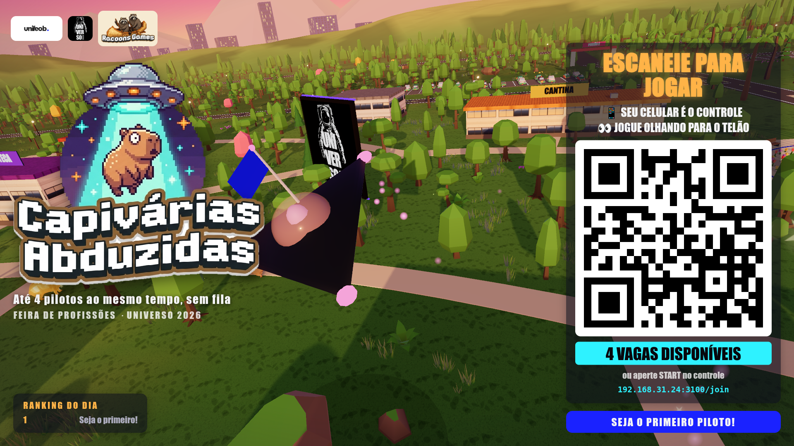
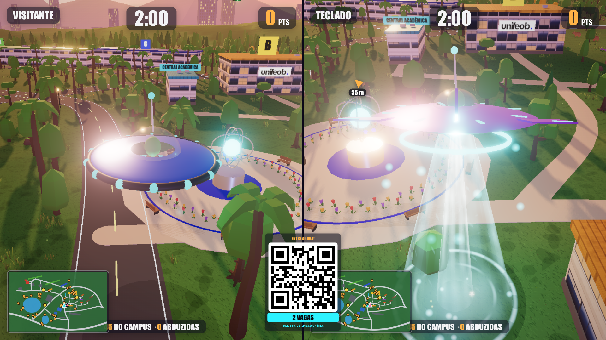
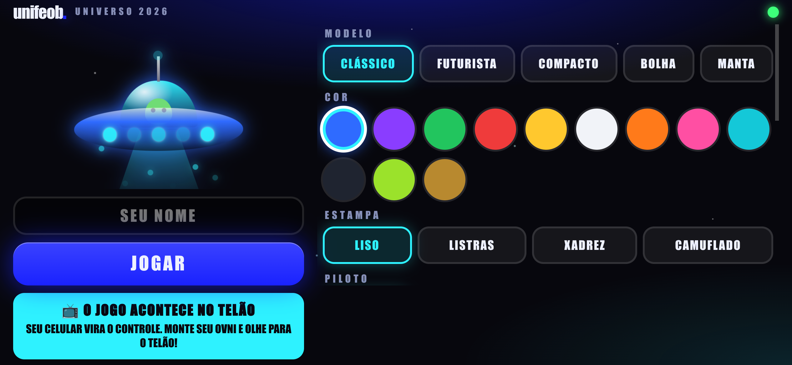
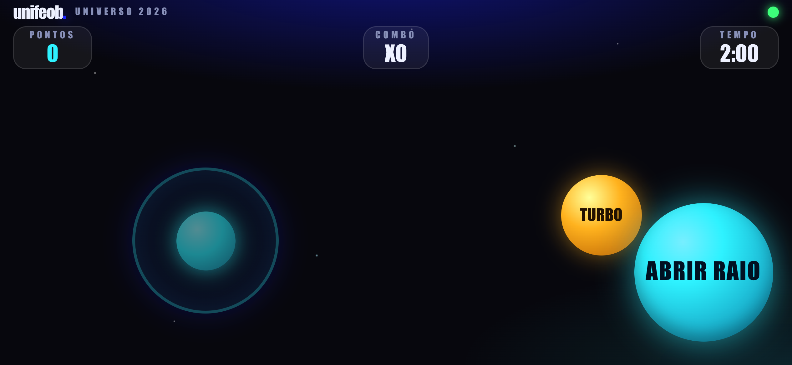
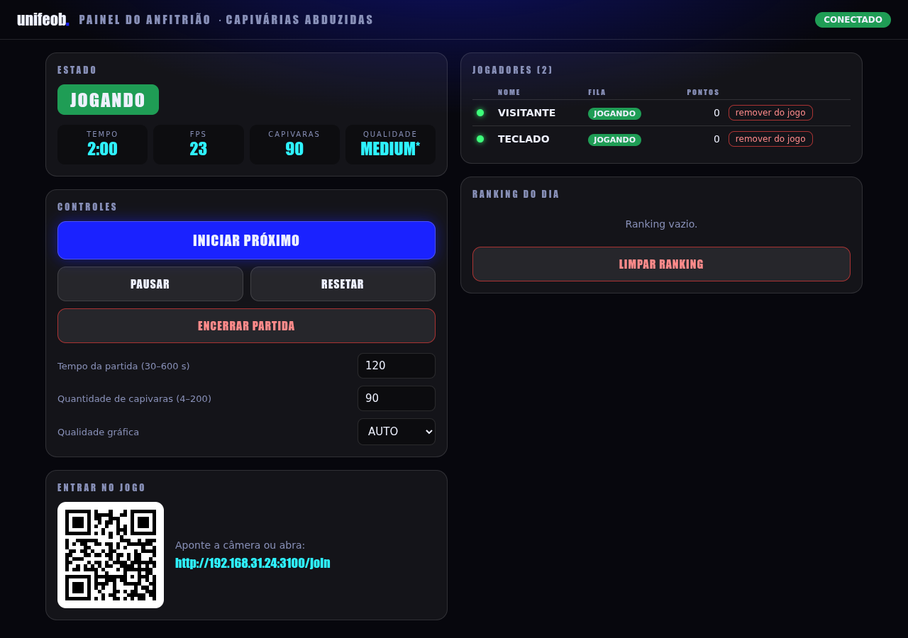

# 🛸 CAPIVÁRIAS ABDUZIDAS — UniFEOB / UNIVERSO 2026

Jogo 3D de feira no **campus da FEOB** (mapa digital + fotos aéreas). **O PC é o console** (renderiza tudo); **o celular é só o controle** (HTML leve via WebSocket, sem 3D).
**Sem fila: até 4 pilotos ao mesmo tempo, em tela dividida que se adapta** (1 = tela cheia, 2 = lado a lado, 3–4 = quadrantes). Cada um tem seu próprio cronômetro e entra a qualquer momento pelo QR.
Funciona 100% em rede local, sem internet, sem banco de dados.

## Telas
| Lobby (QR Code + ranking) | Tela dividida com 2 pilotos |
|---|---|
|  |  |

| Controle: montar o OVNI | Controle: jogando (paisagem) |
|---|---|
|  |  |

**Painel do operador** (`/admin`):



> O controle foi pensado para uso **na horizontal** (celular deitado): joystick à esquerda, turbo e raio à direita.

## Rodar
```bash
npm install        # só na 1ª vez (precisa de internet apenas aqui)
npm start          # sobe o servidor na porta 3000 (PORT=8080 npm start para trocar)
npm run kiosk      # (opcional) abre o Chrome em tela cheia, com som liberado
```
- **Tela do jogo** (abrir no PC ligado à TV): `http://localhost:3000/`
- **Controle** (o QR Code do lobby aponta para ele): `http://IP-DO-PC:3000/join`
- **Admin** (só neste PC): `http://localhost:3000/admin` — iniciar, pausar, resetar, encerrar, tempo, nº de capivaras, qualidade, fila, ranking
  (para liberar de outro aparelho: `ADMIN_PIN=1234 npm start` e abrir `/admin?pin=1234`)
- Se o IP detectado estiver errado (várias placas de rede): `HOST_IP=192.168.0.10 npm start`
- PC e celulares na **mesma rede Wi‑Fi/roteador**. Se não conectar, libere a porta no firewall do PC.

## Personalização do OVNI
No celular, antes de jogar: **modelo** (5), **cor** (12), **estampa** (liso/listras/xadrez/camuflado), **piloto** (alien, alien roxo, robô, capivara), **acessório** (8), **luz** (8), **raio** (5 cores + arco-íris), **efeito** (6) e botão 🎲 *sortear*. O nome flutua sobre o OVNI para os outros pilotos. As opções ficam em `public/host/config.js` (`MAX_CFG`), `public/host/models.js` (3D) e `public/join/index.html` (prévia CSS) — mantenha os três e `validCfg` em `server/index.js` em sincronia.

## Ranking
Salvo em **SQLite** no arquivo `data/ranking.db` (cria sozinho; muda com `RANKING_DB=/caminho/arquivo.db`). Usa o `node:sqlite` embutido do Node (>= 22.5), sem dependência extra. A tela mostra o top 5 do dia; "limpar ranking" no admin só esconde o dia atual, o histórico (nome, pontos, capivaras, melhor combo, data) continua no arquivo. Consulta: `sqlite3 data/ranking.db 'select * from scores order by score desc'`.

## Teclado (testes / plano B sem celular)
`Enter` entra como jogador local (TECLADO) · setas/WASD move · `Espaço` raio · `Shift` turbo · `P` pausa · `Esc` reseta · `1/2/3` qualidade LOW/MEDIUM/HIGH · `M` mudo · `F` FPS/draw calls

## Testes e Docker
```bash
npm test           # servidor: HTTP, segurança, protocolo WebSocket, robustez
npm run soak       # resistência no Chrome real: 4 bots, FPS, heap e vazamento de GPU (SOAK_MIN=30 para ensaio longo)
docker build -t capivaras . && docker run -p 3000:3000 capivaras
```

## Qualidade
`LOW / MEDIUM / HIGH` (admin ou teclado). Por padrão fica em **AUTO**: começa em HIGH e desce sozinho se o FPS cair de 50 (com 2+ jogadores o MSAA é desligado e as sombras caem para 1024 automaticamente). Forçar: `/?q=MEDIUM&auto=0`.

## Estrutura
```
server/index.js      HTTP estático + WebSocket + QR local + validação/rate-limit (protocolo documentado no topo)
public/host/         jogo 3D (Three.js via importmap, sem bundler): world, campus, ufo, capy, fx, audio, ui, main
public/host/nature.js  carrega os modelos Kenney e “assa” cor/AO no vértice; campus.js os agrupa em BatchedMesh por célula (1 draw por célula)
public/assets/       capivara (FBX, rig procedural em capy.js), nature/ e cars/ (Kenney Nature Kit e Car Kit, CC0)
public/join/         controle mobile (1 arquivo, sem dependências)
public/admin/        painel do operador
test/                testes do servidor (node:test) e soak test no Chrome
docs/screenshots/    prints usados neste README
scripts/kiosk.sh     abre o Chrome em modo quiosque
config em public/host/config.js (pontuação, combo, tempo, velocidades, qualidade)
```

## Créditos dos modelos
Capivara (`public/assets/lowpo+carpincho.FBX`): [Low Poly Capybara no CGTrader](https://www.cgtrader.com/free-3d-models/animal/mammal/low-poly-capybara), modelo gratuito usado sob os termos de licença informados na página do modelo.

Vegetação, pedras e carros: [Kenney](https://kenney.nl) — Nature Kit e Car Kit, licença CC0 (`public/assets/*/LICENSE-Kenney-CC0.txt`). As cores são repintadas na paleta do campus em `public/host/nature.js`.

